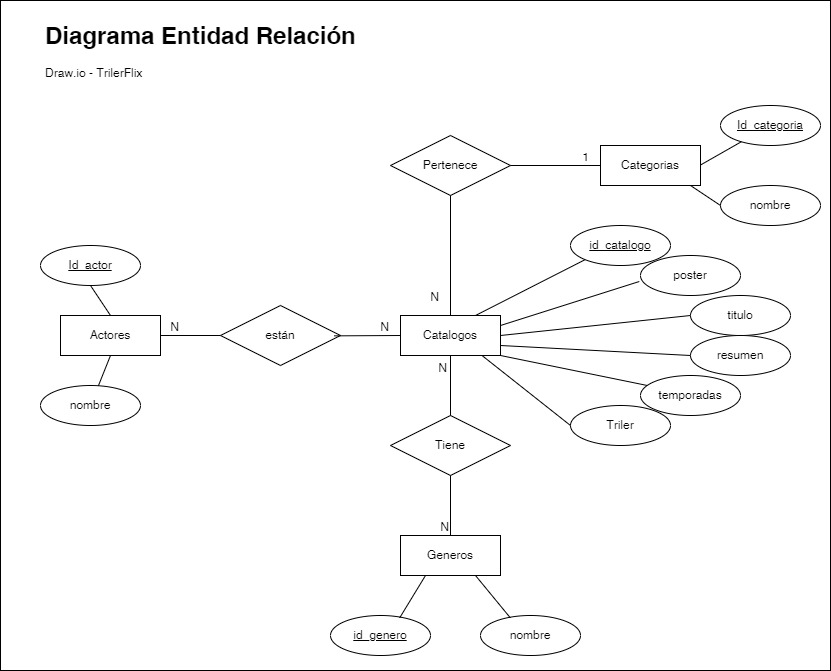
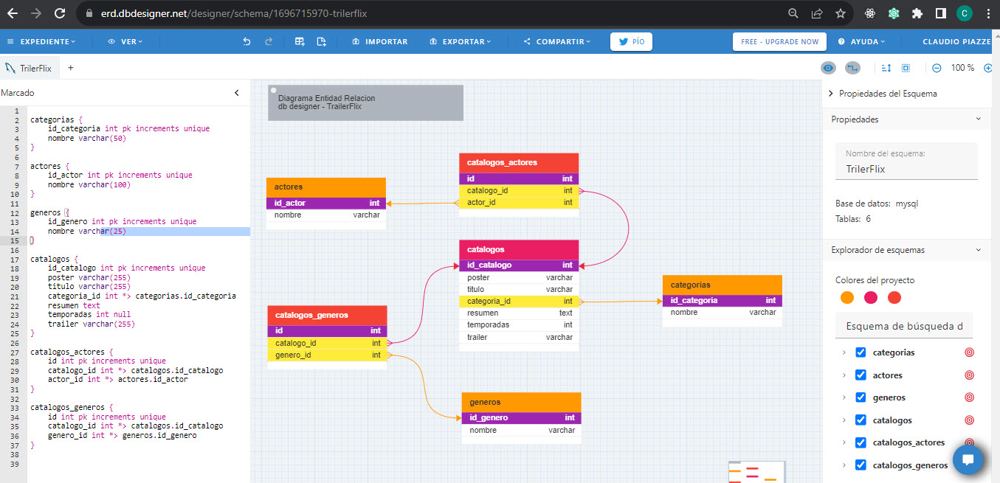
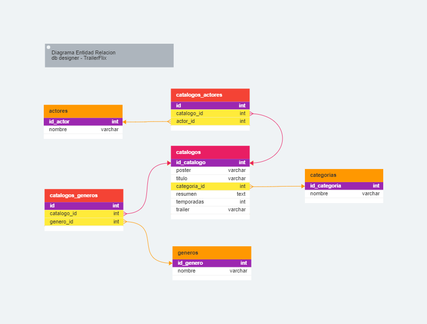
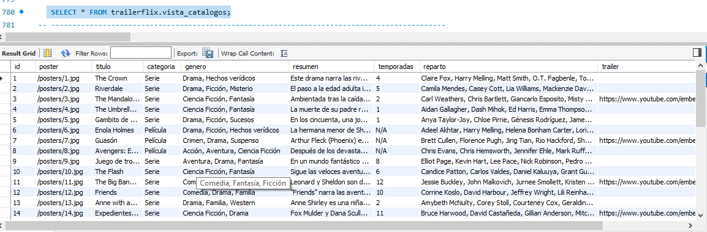

#  Segundo Proyecto Integrador 🚀

## ¿Por que estoy leyendo esto?
Si estas leyendo este README.md es porque un alumno le compartió desde GITHUB un [Archivo en formato .ZIP con el contenido del proyecto integrador](https://github.com/ClaudioPiazze/Proyecto_Integrador_2). 

En el marco de la cursada de la [Diplomatura en Programación WEB Backend](http://cuch.gob.ar/desarrollador-web-full-stack/), 
dictada en modalidad Virtual y Presencial por la [Uiversidad Nacional de 3 de Fefrero (UNTREF)](https://www.untref.edu.ar/) se presenta el segundo trabajo integrador correspondente a lo aprendido en lo que va del segundo cuatrimestre de 2023, donde se deberá desarrollar una aplicación integrando al proyecto *Node.js* *Express*, *Sequelize* y *MySQL*.

## Objetivo
El _objetivo de este desarrollo_ es demostrar a través de un trabajo integrador los diferentes temas aprendidos y tener la experiencia de poder desarrollar forma individual para llegar al objetivo propuesto por la cátedra.

## JSON elejido para poblar la Base de Datos : 

| Archivo | Descripción |
|--------------|--------------|
| [TrailerFlix.json ](./readme_data/trailerflix.json) | 🎦 Catálogo de Péliculas y Series   |
	
## El proyecto incuye:
1. El desarrollo de una bb.dd MySQL con el modelo relacional aplicado de acuerdo a la información almacenada en el archivo *Trailerflix.json*.
   	-  catalogos (almacena datos de películas y series)
	-  categorias (serie, película, etc...)
	-  actores (datos de actrices y actores reparto)
	-  generos (Acción, Drama, Terror, Comedia)
	-  2 tablas intermedias (catalogos_repartos, catalogos_actrores)
### Modelo Entidades - Relaciones - Atributos 



utilizando la herraminta https://app.diagrams.net/?src=about

### Modelo Físico



utilizando la herramienta https://erd.dbdesigner.net/designer/schema/1696715970-trilerflix

Zoom del diagrama físico:


luego exporto el código a .SQL para poder crear la bb.dd., tablas y relaciones.

Para la realización del SCRIPT de insersión de datos en las diferentes tablas en MySQL, utilicé las herramienta de IA CHAT-GPT que ayuda a crear los Insert según los datos extraidos del archivo JSON y la ayuda del la herramienta de conversión de formatos (https://conversiontools.io/convert/json-to-excel)  para llevarlo de .JSON a Excel y trabajar los datos de  generos, actores y actrices de reparto.

# API con Node.js, Express y Sequelize

Esta es la API que utiliza Node.js, Express y Sequelize para gestionar categorías de peliculas/series y visualizar el catálogo de peliculas según diferentes criteriosde busqueda.

A continuación, encontrarás la documentación para utilizar esta API.

## Receta:
Para poder hacer funcionar al proyecto debera realizar los siguiente _pasos_:

## Requisitos Previos

Asegúrase de tener Node.js y MySQL instalados en tu sistema antes de ejecutar la aplicación. Además, crea una base de datos MySQL a traves del SCRIPT y configura las credenciales en un archivo `.env` en la raíz del proyecto como se muestra en el siguiente ejemplo.

### - Desde la base de datos MySQL
1. Abrir Workbench de MySQL
2. Ejecutar el siguiente [SCRIPT](./readme_data/3_Trilerflix_Creacion_BD_Tablas_V2.sql) , donde se creará la BB.DD. llamada 'TrailerFlix' con sus tablas, sus  relaciones y la inserción de los datos
3. Al finalizar la ejecución podrá visualizar 
   todos los catálogos con los datos tal cual está en el JSON ejecutando el siguiente query: 

```batch
   SELECT * FROM trailerflix.vista_catalogos;
```


## - Desde Visual Studio Code
### Archivo `.env`

#### Configuración de la base de datos
```plaintext
DB_HOST=localhost
DB_PORT=3000
DB_NAME=TrailerFlix
DB_USER=root (Ejemplo)
DB_PASSWORD=123456 (Ejemplo)
```
## Instalación

1. Desde  Terminal de Visual Studio Code navega al directorio del proyecto:

   ```bash
   cd Proyecto_Integrador_2
   ```

2. Clonar este repositorio desde:

   ```bash
   git clone https://github.com/ClaudioPiazze/Proyecto_Integrador_2/
   ```

3. Inicialiaza e Instala las dependencias:

- terminal --> **npm** init -y.
- terminal --> **npm** install dotenv
- terminal --> **npm** install express
- terminal --> **npm** install Sequelize
- terminal --> **npm** install mysql2
 

4. Inicializa el servidor Express:

   ```bash
   npm start server.js
   ```


## Endpoints

A continuación, se detallan los endpoints disponibles y cómo utilizarlos:

### Categorías

## ¿Como se compone la Creación, Lectura, Actualizacion y Borrado de una categoria? 

#### Listar todas las categorías

- **URL**: `/categorias`  Ejemplo de URL Completo: 'http://localhost:3000/categorias'
- **Método**: `GET`
- **Respuesta Exitosa**:
  - **Código**: 200 OK
  - **Ejemplo de Respuesta**:

    ```json
	[
	{
		"id_categoria": 1,
		"nombre": "Serie"
	},
	{
		"id_categoria": 2,
		"nombre": "Película"
	}
	]
    ```

#### Crear una nueva categoría

- **URL**: `/categorias` Ejemplo de URL Completo: 'http://localhost:3000/categorias'
- **Método**: `POST`
- **Cuerpo de la Petición**:

  ```json
  {
       "nombre": "Documental"
  }
  ```

- **Respuesta Exitosa**:
  - **Código**: 200 OK
  - **Ejemplo de Respuesta**:

    ```json
	{
	"id_categoria": 3,
	"nombre": "Documental"
	}
    ```

#### Actualizar una categoría por ID

- **URL**: `/categorias/:id` Ejemplo de URL Completo: 'http://localhost:3000/categorias/3'
- **Método**: `PUT`
- **:id**: `3`
- **Cuerpo de la Petición**:

  ```json
  {
       "nombre": "Documental de Ciencias Naturales"
  }
  ```

- **Respuesta Exitosa**:
  - **Código**: 200 OK
  - **Ejemplo de Respuesta**:

  ```json
  {
	"id_categoria": 3,
	"nombre": "Documental de Ciencias Naturales"
  }
  ```

#### Eliminar una categoría por ID

- **URL**: `/categorias/:id` Ejemplo de URL Completo: 'http://localhost:3000/categorias/3'
- **Método**: `DELETE`
- **Respuesta Exitosa**:
  - **Código**: 200 OK
  - **Ejemplo de Respuesta**:

 ```json
  {
 	"mensaje": "Categoría eliminada exitosamente"
  }
  ```

### Catalogos

#### Obtener todos los datos del catálogo

- **URL**: `/catalogos`  Ejemplo de URL Completo: 'http://localhost:3000/catalogos'
- **Método**: `GET`
- **Respuesta Exitosa**:
  - **Código**: 200 OK
  - **Ejemplo de Respuesta**:

  ```json
  {
    "id": 1,
    "poster": "/posters/1.jpg",
    "titulo": " The Crown",
    "categoria": "Serie",
    "genero": "Drama, Hechos verídicos",
    "resumen": "Este drama narra las rivalidades políticas y el romance de la reina Isabel II, así como los sucesos que moldearon la segunda mitad del siglo XX.",
    "temporadas": "4",
    "reparto": "Claire Fox, Harry Melling, Matt Smith, O.T. Fagbenle, Tobias Menzies, Vanesa Kirby",
    "trailer": ""
  },
  {
    "id": 2,
    "poster": "/posters/2.jpg",
    "titulo": " Riverdale",
    "categoria": "Serie",
    "genero": "Drama, Ficción, Misterio",
    "resumen": "El paso a la edad adulta incluye sexo, romance, escuela y familia. Para Archie y sus amigos, también hay misterios oscuros.",
    "temporadas": "5",
    "reparto": "Camila Mendes, Casey Cott, Lia Williams, Mackenzie Davis, Madelaine Petsch, Marisol Nichols",
    "trailer": ""
  },
  {
    "id": 3,
    "poster": "/posters/3.jpg",
    "titulo": " The Mandalorian",
    "categoria": "Serie",
    "genero": "Ciencia Ficción, Fantasía",
    "resumen": "Ambientada tras la caída del Imperio y antes de la aparición de la Primera Orden, la serie sigue los pasos de un pistolero solitario en las aventuras que protagoniza en los confines de la galaxia, donde no alcanza la autoridad de la Nueva República.",
    "temporadas": "2",
    "reparto": "Carl Weathers, Chris Bartlett, Giancarlo Esposito, Misty Rosas, Paul Ritter, Rinko Kikuchi",
    "trailer": "https://www.youtube.com/embed/aOC8E8z_ifw"
  },
  ......
  ......(Se corta a drede por tema de espacio)
  ......
  {
    "id": 33,
    "poster": "/posters/33.jpg",
    "titulo": " Soy leyenda",
    "categoria": "Película",
    "genero": "Drama, Ficción, Terror",
    "resumen": "Años después de que una plaga mate a la mayoría de la humanidad y transforme al resto en monstruos, el único superviviente en la ciudad de Nueva York lucha valientemente para encontrar una cura.",
    "temporadas": "N/A",
    "reparto": "Alice Braga, Charlie Tahan, Danielle Panabaker, Emily Watson, Ryan Gosling, Will Smith, Willow Smith",
    "trailer": "https://www.youtube.com/embed/dtKMEAXyPkg"
  },
  {
    "id": 34,
    "poster": "/posters/34.jpg",
    "titulo": " El primer hombre en la luna",
    "categoria": "Película",
    "genero": "Drama, Hechos verídicos",
    "resumen": "Cuenta la historia de la misión de la NASA que llevó al primer hombre a la luna, centrada en Neil Armstrong (interpretado por Ryan Gosling) y el periodo comprendido entre los años 1961 y 1969. Un relato en primera persona, basado en la novela de James R. Hansen, que explora el sacrificio y el precio que representó, tanto para Armstrong como para Estados Unidos, una de las misiones más peligrosas de la historia.",
    "temporadas": "N/A",
    "reparto": "Claire Fox, Corey Johnson, Jared Harris, Kunal Nayyar, Oscar Isaac, Rosie Perez",
    "trailer": ""
  },
  {
    "id": 35,
    "poster": "/posters/35.jpg",
    "titulo": " Titanes del pacífico - La insurrección",
    "categoria": "Película",
    "genero": "Acción, Ciencia Ficción, Fantasía",
    "resumen": "Han pasado 10 años tras la primera invasión que sufrió la humanidad, pero la lucha aún no ha terminado. El planeta vuelve a ser asediado por los Kaiju, una raza de alienígenas colosales, que emergen desde un portal interdimensional con el objetivo de destruir a la raza humana. Ante esta nueva amenaza, los Jaegers, robots gigantes de guerra pilotados por dos personas para sobrellevar la inmensa carga neuronal que conlleva manipularlos, ya no están a la altura de lo que se les viene encima. Será entonces cuando los supervivientes de la primera invasión, además de nuevos personajes como el hijo de Pentecost, tendrán que idear la manera de sorprender al enorme enemigo, apostando por nuevas estrategias defensivas y de ataque. Con la Tierra en ruinas e intentando reconstruirse, esta nueva batalla puede ser decisiva para el futuro.",
    "temporadas": "N/A",
    "reparto": "Burn Gorman, Cailee Spaeny, Jim Parsons, Joaquin Phoenix, Rhona Mitra, Scott Eastwood",
    "trailer": ""
  }
  ```

#### Obtener datos del catálogo por número de ID

- **URL**: `/catalogos/:id` Ejemplo de URL Completo: 'http://localhost:3000/catalogos/4'
- **Método**: `GET`
- **:id**: `4`
- **Respuesta Exitosa**:
  - **Código**: 200 OK
  - **Ejemplo de Respuesta**:

 ```json
{
  "id": 4,
  "poster": "/posters/4.jpg",
  "titulo": " The Umbrella Academy",
  "categoria": "Serie",
  "genero": "Ciencia Ficción, Fantasía",
  "resumen": "La muerte de su padre reúne a unos hermanos distanciados y con extraordinarios poderes que descubren impactantes secretos y una amenaza que se cierne sobre la humanidad.",
  "temporadas": "1",
  "reparto": "Aidan Gallagher, Dash Mihok, Ed Harris, Emma Thompson, Robert Patrick, Tom Hopper",
  "trailer": ""
}
```

#### Obtener datos de catálogo por Títulos (Puede ser una fracción del título)

- **URL**: `/catalogos/titulo/:query` Ejemplo de URL Completo: 'http://localhost:3000/catalogos/titulo/luna'
- **Método**: `GET`
- **:query**: `luna`
- **Código del endpoint en javaScript**:
```javascript
// Ruta para consultar el catalogo por Titulo/Nombre de la pelicula o serie
  app.get('/catalogos/nombre/:query', async (req, res) => {
    try {
          const { query } = req.params;
          const catalogo = await Catalogo.findAll({ 
                where: { titulo: {
                                [Op.like]: `%${ query }%` ,
                                }, 
                    }, 
        });

        !catalogo ? res.status(404).json({ error: 'Catálogo no encontrado' })
                  : res.status(200).json(catalogo);
    } catch (error) {
          res.status(500).json({ error: 'Error en el servidor, al buscar catálogo por Título', description: error.message });
    }
});

```


- **Respuesta Exitosa**:
  - **Código**: 200 OK
  - **Ejemplo de Respuesta**:

 ```json
 [
  {
    "id": 34,
    "poster": "/posters/34.jpg",
    "titulo": " El primer hombre en la luna",
    "categoria": "Película",
    "genero": "Drama, Hechos verídicos",
    "resumen": "Cuenta la historia de la misión de la NASA que llevó al primer hombre a la luna, centrada en Neil Armstrong (interpretado por Ryan Gosling) y el periodo comprendido entre los años 1961 y 1969. Un relato en primera persona, basado en la novela de James R. Hansen, que explora el sacrificio y el precio que representó, tanto para Armstrong como para Estados Unidos, una de las misiones más peligrosas de la historia.",
    "temporadas": "N/A",
    "reparto": "Claire Fox, Corey Johnson, Jared Harris, Kunal Nayyar, Oscar Isaac, Rosie Perez",
    "trailer": ""
  }
]
```

#### Obtener datos del catálogo por genero

- **URL**: `/catalogos/genero/:query` Ejemplo de URL Completo: 'http://localhost:3000/catalogos/genero/tecnologia'
- **Método**: `GET`
- **:query**: `tecnologia`
- **Respuesta Exitosa**:
  - **Código**: 200 OK
  - **Ejemplo de Respuesta**:

 ```json
[
  {
    "id": 17,
    "poster": "/posters/17.jpg",
    "titulo": " Halt and Catch Fire",
    "categoria": "Serie",
    "genero": "Drama, Ficción, Tecnología",
    "resumen": "Situada en los inicios de la década de 1980, un visionario ficticio, un ingeniero electrónico y una prodigiosa ingeniera, se alían a una programadora de software para confrontar con las corporaciones informáticas dominantes de la época. El Personal de la firma y sus socios de negocio, comenzarán una carrera que cambiará la cultura en el Estado de Texas, cuna de las empresas de tecnología, casi de la misma forma que lo es hoy Silicon Valey. \n Esta historia ficticia emula el trabajo realizado, en su momento, por la firma Compaq, cuando clonó el BIOS de las Computadoras Personales IBM, dando vida así al económico mercado de los clones. Mostrando también, a lo largo de sus 4 temporadas, el nacimiento de la arquitectura abierta de hardware, los videojuegos online, las salas de chat y de trueque de productos físicos, los BBS, y las primeras nubes computacionales, hasta la llegada de Internet (sin dejar afuera la guerra de los web browsers).",
    "temporadas": "4",
    "reparto": "Alana Cavanaugh, Kate Winslet, Laurence Fishburne, Lupita Nyongo, Scoot McNairy, Toby Huss",
    "trailer": "https://www.youtube.com/embed/pWrioRji60A"
  }
]
```

#### Obtener datos del catálogo por categoría

- **URL**: `/catalogos/categoria/:query` Ejemplo de URL Completo: 'http://localhost:3000/catalogos/categoria/pelicula'
- **Método**: `GET`
- **:query**: `pelicula`
- **Respuesta Exitosa**:
  - **Código**: 200 OK
  - **Ejemplo de Respuesta**:
``` json
[
  {
    "id": 6,
    "poster": "/posters/6.jpg",
    "titulo": " Enola Holmes",
    "categoria": "Película",
    "genero": "Drama, Ficción, Hechos verídicos",
    "resumen": "La hermana menor de Sherlock, descubre que su madre ha desaparecido y se dispone a encontrarla. En su búsqueda, saca a relucir el sabueso que corre por sus venas y se encuentra con una conspiración que gira en torno a un misterioso lord, demostrando que su ilustre hermano no es el único talento en la familia.",
    "temporadas": "N/A",
    "reparto": "Adeel Akhtar, Harry Melling, Helena Bonham Carter, Lorina Kamburova, Millie Bobby Brown, Salli Richardson-Whitfield",
    "trailer": ""
  },
  {
    "id": 7,
    "poster": "/posters/7.jpg",
    "titulo": " Guasón",
    "categoria": "Película",
    "genero": "Crimen, Drama, Suspenso",
    "resumen": "Arthur Fleck (Phoenix) es un hombre ignorado por la sociedad, cuya motivación en la vida es hacer reír. Pero una serie de trágicos acontecimientos le llevarán a ver el mundo de otra forma. Película basada en el popular personaje de DC Comics Joker, conocido como archivillano de Batman, pero que en este film tomará un cariz más realista y oscuro.",
    "temporadas": "N/A",
    "reparto": "Brett Cullen, Florence Pugh, Jing Tian, Rio Hackford, Shea Whigham, Zazie Beetz",
    "trailer": "https://www.youtube.com/embed/zAGVQLHvwOY"
  },
  {
    "id": 8,
    "poster": "/posters/8.jpg",
    "titulo": " Avengers: End Game",
    "categoria": "Película",
    "genero": "Acción, Aventura, Ciencia Ficción",
    "resumen": "Después de los devastadores eventos de los Vengadores: Infinity War (2018), el universo está en ruinas. Con la ayuda de los aliados restantes, los Vengadores se reúnen una vez más para revertir las acciones de Thanos y restaurar el equilibrio del universo.",
    "temporadas": "N/A",
    "reparto": "Chris Evans, Chris Hemsworth, Jennifer Ehle, Mark Ruffalo, Robert De Niro, Sam Claflin",
    "trailer": ""
  },
  {
    "id": 18,
    "poster": "/posters/18.jpg",
    "titulo": " Ava",
    "categoria": "Película",
    "genero": "Acción, Drama, Suspenso",
    "resumen": "Ava es una mortífera asesina a sueldo que trabaja para una organización de operaciones encubiertas, que viaja por todo el mundo acabando con aquellos objetivos que nadie más puede derribar. Cuando uno de sus encargos sale mal, Ava tendrá que luchar por una vida.",
    "temporadas": "N/A",
    "reparto": "Claire Selby, Colin Farrell, Gana Bayarsaikhan, Henry Cavill, Jesse L. Martin, John Boyega",
    "trailer": ""
  },
  {
    "id": 19,
    "poster": "/posters/19.jpg",
    "titulo": " Aves de presa y la fantabulosa emancipación de una Harley Quinn",
    "categoria": "Película",
    "genero": "Acción, Comedia, Ficción",
    "resumen": "Después de separarse de Joker, Harley Quinn y otras tres heroínas (Canario Negro, Cazadora y Renée Montoya) unen sus fuerzas para salvar a una niña (Cassandra Cain) del malvado rey del crimen Máscara Negra.",
    "temporadas": "N/A",
    "reparto": "Chris Messina, Evan Rachel Wood, Judy Greer, Margot Robbie, Mary Elizabeth Winstead, Robert Sheehan",
    "trailer": ""
  },
  {
    "id": 20,
    "poster": "/posters/20.jpg",
    "titulo": " Archivo",
    "categoria": "Película",
    "genero": "Acción, Ciencia Ficción, Suspenso",
    "resumen": "2038: George Almore está trabajando en una verdadera IA equivalente a la humana. Su último prototipo está casi listo. Esta fase sensible también es la más arriesgada. Especialmente porque tiene un objetivo que debe ocultarse a toda costa: reunirse con su esposa muerta.",
    "temporadas": "N/A",
    "reparto": "Lena Headey, Peter Dinklage, Ray Winstone, Stacy Martin, Theo James, Toby Jones",
    "trailer": "https://www.youtube.com/embed/VHSoCnDioAo"
  },
  {
    "id": 21,
    "poster": "/posters/21.jpg",
    "titulo": " Jumanji - The next level",
    "categoria": "Película",
    "genero": "Aventura, Comedia, Ficción",
    "resumen": "Las aventuras continúan en el fantástico mundo del video juego Jumanji, donde nada es lo que parece. En esta ocasión, los jugadores vuelven al juego, pero sus personajes se han intercambiado entre sí, lo que ofrece un curioso plantel: los mismos héroes con distinta apariencia y habilidades. Pero, ¿dónde está el resto de la gente?",
    "temporadas": "N/A",
    "reparto": "Awkwafina, Dominic Mafham, Isaiah Mustafa, Kaley Cuoco, Kerry Bishé, Mädchen Amick",
    "trailer": "https://www.youtube.com/embed/rBxcF-r9Ibs"
  },
  {
    "id": 22,
    "poster": "/posters/22.jpg",
    "titulo": " 3022",
    "categoria": "Película",
    "genero": "Ciencia Ficción, Suspenso",
    "resumen": "La película está ambientada en una estación espacial en el futuro. La tripulación sufre un estrés traumático y considera abandonar su misión después de observar lo que creen que es la destrucción de la Tierra. La película se muestra como una serie de flashbacks y flash-forward.",
    "temporadas": "N/A",
    "reparto": "Angus Macfadyen, Emmy Raver-Lampman, Jon Bernthal, Kate Mara, Miranda Cosgrove, Olivia Colman",
    "trailer": "https://www.youtube.com/embed/AGQ7OkmIx4Q"
  },
  {
    "id": 23,
    "poster": "/posters/23.jpg",
    "titulo": " IT - Capítulo 2",
    "categoria": "Película",
    "genero": "Fantasía, Suspenso, Terror",
    "resumen": "En este segundo capitulo Han pasado 27 años desde que el \"Club de los Perdedores\", formado por Bill, Berverly, Richie, Ben, Eddie, Mike y Stanley, se enfrentaran al macabro y despiadado Pennywise (Bill Skarsgård). En cuanto tuvieron oportunidad, abandonaron el pueblo de Derry, en el estado de Maine, que tantos problemas les había ocasionado. Sin embargo, ahora, siendo adultos, parece que no pueden escapar de su pasado. Todos deberán enfrentarse de nuevo al temible payaso para descubrir si de verdad están preparados para superar sus traumas de la infancia.",
    "temporadas": "N/A",
    "reparto": "Bill Hader, Bill Skarsgård, Irrfan Khan, Jack Black, Jason Clarke, Jesse L. Martin",
    "trailer": "https://www.youtube.com/embed/hZeFeYSmBcg"
  },
  {
    "id": 24,
    "poster": "/posters/24.jpg",
    "titulo": " Pantera Negra",
    "categoria": "Película",
    "genero": "Acción, Aventura, Fantasía",
    "resumen": "T’Challa (Chadwick Boseman) regresa a su hogar en la apartada nación africana de Wakanda para servir como líder de su país. Tras suceder a su padre en el trono, pasa a convertirse en Pantera Negra, una sigilosa criatura de la noche, con agudos sentidos felinos y otras habilidades como súper fuerza e inteligencia, agilidad, estrategia o maestro del combate sin armas. Es bajo el liderazgo de T’Challa como Wakanda consigue convertirse en una de las naciones más ricas y tecnológicamente avanzadas del planeta.",
    "temporadas": "N/A",
    "reparto": "Chadwick Boseman, Dalila Bela, Danai Gurira, Luke Hemsworth, Martin Freeman, Michael B. Jordan",
    "trailer": "https://www.youtube.com/embed/BE6inv8Xh4A"
  },
  {
    "id": 25,
    "poster": "/posters/25.jpg",
    "titulo": " Contra lo imposible (Ford versus Ferrari)",
    "categoria": "Película",
    "genero": "Aventura, Drama, Historia",
    "resumen": "Los ganadores del Premio de la Academia® Matt Damon y Christian Bale protagonizan CONTRA LO IMPOSIBLE, basada en la historia real del visionario diseñador americano de automóviles Carroll Shelby (Damon) y el intrépido piloto británico Ken Miles (Bale). Juntos construyen un nuevo coche de carreras para Ford Motor Company y así enfrentar a Enzo Ferrari en las 24 Horas de Le Mans en Francia en 1966.",
    "temporadas": "N/A",
    "reparto": "Caitriona Balfe, Christian Bale, Johnny Galecki, Jorja Fox, Matt Damon, Nina Bergman",
    "trailer": "https://www.youtube.com/embed/SOVb0-2g1Q0"
  },
  {
    "id": 26,
    "poster": "/posters/26.jpg",
    "titulo": " Centígrados",
    "categoria": "Película",
    "genero": "Drama, Intriga, Suspenso",
    "resumen": "Una joven pareja estadounidense viaja a las montañas árticas de Noruega. Después de detenerse durante una tormenta de nieve, se despiertan atrapados en su SUV, enterrados bajo capas de nieve y hielo.",
    "temporadas": "N/A",
    "reparto": "Benjamin Sokolow, Emilia Clarke, Geena Davis, Vincent Piazza",
    "trailer": ""
  },
  {
    "id": 27,
    "poster": "/posters/27.jpg",
    "titulo": " DOOM: Aniquilación",
    "categoria": "Película",
    "genero": "Acción, Ciencia Ficción, Terror",
    "resumen": "Doom: Aniquilación sigue a un grupo de marines espaciales que han respondido a una llamada de alerta de una base en la luna marciana, solo para descubrir que ha sido tomada por criaturas demoníacas que amenazan con desatar el infierno en la tierra.",
    "temporadas": "N/A",
    "reparto": "Amy Manson, Domhnall Gleeson, James McAvoy, Lisa Kudrow, Lucas Jade Zumann, Nikolaj Coster-Waldau",
    "trailer": "https://www.youtube.com/embed/nat3u3gAVLE"
  },
  {
    "id": 28,
    "poster": "/posters/28.jpg",
    "titulo": " Contagio",
    "categoria": "Película",
    "genero": "Drama, Ficción, Suspenso",
    "resumen": "De repente, sin saber cuál es su origen, aunque todo hace sospechar que comienza con el viaje de una norteamericana a un casino de Hong Kong, un virus mortal comienza a propagarse por todo el mundo. En pocos días, la enfermedad empieza a diezmar a la población. El contagio se produce por mero contacto entre los seres humanos. Un thriller realista y sin efectos especiales sobre los efectos de una epidemia.",
    "temporadas": "N/A",
    "reparto": "Gwyneth Paltrow, Jennifer Aniston, Josh Lucas, Kate Walsh, Kyle Chandler, Marion Cotillard, Matt Damon",
    "trailer": "https://www.youtube.com/embed/4sYSyuuLk5g"
  },
  {
    "id": 29,
    "poster": "/posters/29.jpg",
    "titulo": " Viuda Negra",
    "categoria": "Película",
    "genero": "Acción, Aventura, Drama",
    "resumen": "Primera pelicula individual de la Viuda Negra en el universo cinematografico de Marvel, contando su historia desde que se inició como doble agente rusa, su niñez, sus misiones, y su actualidad, después de Avengers.",
    "temporadas": "N/A",
    "reparto": "David Duchovny, Ewan McGregor, Noah Jupe, R. H. Thomson, Rachel Weisz, Scarlett Johansson, William Hurt",
    "trailer": "https://www.youtube.com/embed/BIn8iANwEog"
  },
  {
    "id": 30,
    "poster": "/posters/30.jpg",
    "titulo": " The Martian",
    "categoria": "Película",
    "genero": "Aventura, Ciencia Ficción, Drama",
    "resumen": "Durante una misión a Marte de la nave tripulada Ares III, una fuerte tormenta se desata dando por desaparecido y muerto al astronauta Mark Watney (Matt Damon), sus compañeros toman la decisión de irse pero él ha sobrevivido. Está solo y sin apenas recursos en el planeta. Con muy pocos medios deberá recurrir a sus conocimientos, su sentido del humor y un gran instinto de supervivencia para lograr sobrevivir y comunicar a la Tierra que todavía está vivo esperando que acudan en su rescate.",
    "temporadas": "N/A",
    "reparto": "Jay Ryan, Jesse L. Martin, Karen Gillan, Kit Harington, Matt Damon, Michael Peña, Sean Bean",
    "trailer": "https://www.youtube.com/embed/XvB58bCVfng"
  },
  {
    "id": 31,
    "poster": "/posters/31.jpg",
    "titulo": " Ex-Machina",
    "categoria": "Película",
    "genero": "Ciencia Ficción, Drama, Suspenso",
    "resumen": "Un programador multimillonario selecciona a Caleb, un joven empleado de su empresa, para que pase una semana en un lugar remoto con el objetivo de que participe en un test en el que estará involucrada su última creación: un robot-mujer en el que inteligencia artificial lo es todo.",
    "temporadas": "N/A",
    "reparto": "Alicia Vikander, Claire Foy, Common, David Schwimmer, Frances Conroy, Omar Sy, Sonoya Mizuno",
    "trailer": "https://www.youtube.com/embed/XRYL5spvEcI"
  },
  {
    "id": 32,
    "poster": "/posters/32.jpg",
    "titulo": " Jurassic World",
    "categoria": "Película",
    "genero": "Aventura, Ficción, Suspenso",
    "resumen": "Veintidós años después de lo ocurrido en Jurassic Park, la isla Nublar ha sido transformada en un enorme parque temático, Jurassic Wold, con versiones «domesticadas» de algunos de los dinosaurios más conocidos. Cuando todo parece ir sobre ruedas y ser el negocio del siglo, un nuevo dinosaurio de especie desconocida, pues ha sido creado manipulando genéticamente su ADN, y que resulta ser mucho más inteligente de lo que se pensaba, se escapa de su recinto y comienza a causar estragos entre los visitantes del Parque.",
    "temporadas": "N/A",
    "reparto": "Bryce Dallas Howard, Chris Pratt, Ioan Gruffudd, Jude Law, Nick Jonas, Omar Epps, Vincent D Onofrio",
    "trailer": ""
  },
  {
    "id": 33,
    "poster": "/posters/33.jpg",
    "titulo": " Soy leyenda",
    "categoria": "Película",
    "genero": "Drama, Ficción, Terror",
    "resumen": "Años después de que una plaga mate a la mayoría de la humanidad y transforme al resto en monstruos, el único superviviente en la ciudad de Nueva York lucha valientemente para encontrar una cura.",
    "temporadas": "N/A",
    "reparto": "Alice Braga, Charlie Tahan, Danielle Panabaker, Emily Watson, Ryan Gosling, Will Smith, Willow Smith",
    "trailer": "https://www.youtube.com/embed/dtKMEAXyPkg"
  },
  {
    "id": 34,
    "poster": "/posters/34.jpg",
    "titulo": " El primer hombre en la luna",
    "categoria": "Película",
    "genero": "Drama, Hechos verídicos",
    "resumen": "Cuenta la historia de la misión de la NASA que llevó al primer hombre a la luna, centrada en Neil Armstrong (interpretado por Ryan Gosling) y el periodo comprendido entre los años 1961 y 1969. Un relato en primera persona, basado en la novela de James R. Hansen, que explora el sacrificio y el precio que representó, tanto para Armstrong como para Estados Unidos, una de las misiones más peligrosas de la historia.",
    "temporadas": "N/A",
    "reparto": "Claire Fox, Corey Johnson, Jared Harris, Kunal Nayyar, Oscar Isaac, Rosie Perez",
    "trailer": ""
  },
  {
    "id": 35,
    "poster": "/posters/35.jpg",
    "titulo": " Titanes del pacífico - La insurrección",
    "categoria": "Película",
    "genero": "Acción, Ciencia Ficción, Fantasía",
    "resumen": "Han pasado 10 años tras la primera invasión que sufrió la humanidad, pero la lucha aún no ha terminado. El planeta vuelve a ser asediado por los Kaiju, una raza de alienígenas colosales, que emergen desde un portal interdimensional con el objetivo de destruir a la raza humana. Ante esta nueva amenaza, los Jaegers, robots gigantes de guerra pilotados por dos personas para sobrellevar la inmensa carga neuronal que conlleva manipularlos, ya no están a la altura de lo que se les viene encima. Será entonces cuando los supervivientes de la primera invasión, además de nuevos personajes como el hijo de Pentecost, tendrán que idear la manera de sorprender al enorme enemigo, apostando por nuevas estrategias defensivas y de ataque. Con la Tierra en ruinas e intentando reconstruirse, esta nueva batalla puede ser decisiva para el futuro.",
    "temporadas": "N/A",
    "reparto": "Burn Gorman, Cailee Spaeny, Jim Parsons, Joaquin Phoenix, Rhona Mitra, Scott Eastwood",
    "trailer": ""
  }
]
``` 


## Canal Discord de la Diplomatura Chivilcoy Backend
En este **[canal](https://discord.com/channels/1041764377386287134/1096437854118359050)** compartimos las dudas, y material de la cursada :smiley:


## Alumnno:
| Apellido y Nombre | GitHub | E-mail |
|-------------|--|--------------|
|  PIAZZE, Claudio  |[Link](https://github.com/ClaudioPiazze/) | cpiazze@hotmail.com |

