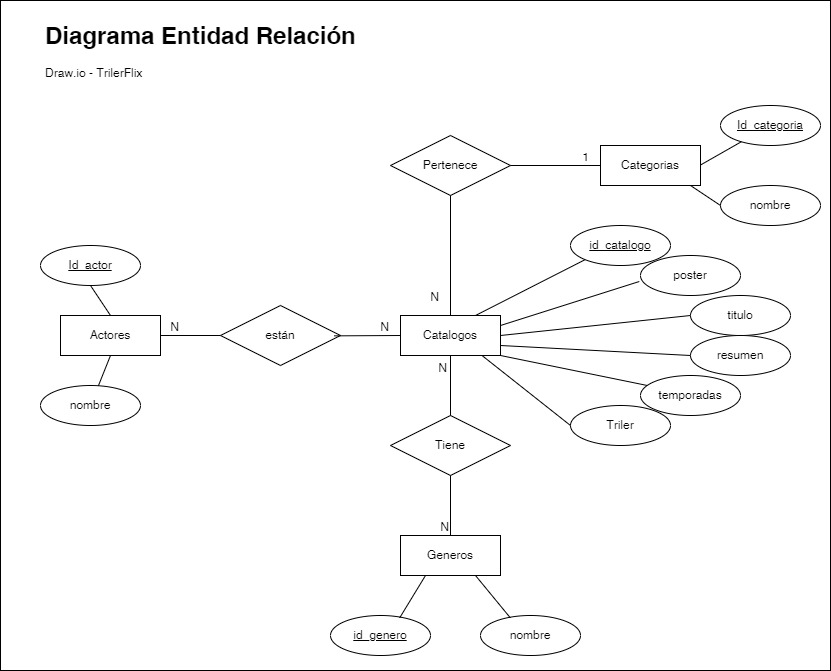
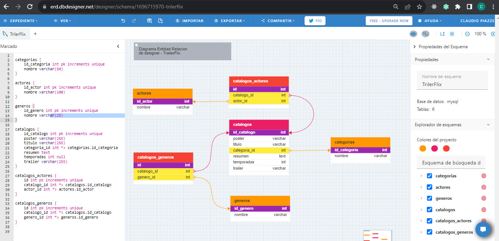
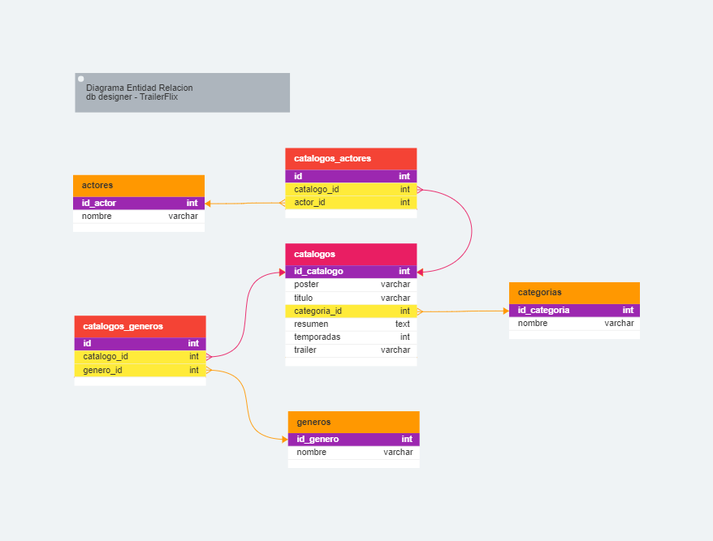

#  Segundo Proyecto Integrador 🚀

## ¿Por que estoy leyendo esto?
Si estas leyendo este README.md es porque un alumno le compartió desde GITHUB un [Archivo en formato .ZIP con el contenido del proyecto integrador](https://github.com/ClaudioPiazze/Proyecto_Integrador_2). 

En el marco de la cursada de la [Diplomatura en Programación WEB Backend](http://cuch.gob.ar/desarrollador-web-full-stack/), 
dictada en modalidad Virtual y Presencial por la [Uiversidad Nacional de 3 de Fefrero (UNTREF)](https://www.untref.edu.ar/) se presenta el segundo trabajo integrador correspondente a lo aprendido en lo que va del segundo cuatrimestre de 2023, donde se deberá desarrollar una aplicación integrando al proyecto *Node.js* *Express*, *Sequelize* y *MySQL*.

## Objetivo
El _objetivo de este desarrollo_ es demostrar a través de un trabajo integrador los diferentes temas aprendidos y tener la experiencia de poder desarrollar forma individual para llegar al objetivo propuesto por la cátedra.

## JSON elejido para poblar la Base de Datos : 

| Archivo | Descripción |
|--------------|--------------|
| TrailerFlix.json  | 🎦 Catalogo de Péliculas y Series   |
	
## El proyecto incuye:
1. El desarrollo de una bb.dd MySQL con el modelo relacional aplicado de acuerdo a la información almacenada en el archivo *Trailerflix.json*.
   	-  catalogos (almacena datos de películas y series)
	-  categorias (serie, película, etc...)
	-  actores (datos de actrices y actores reparto)
	-  generos (Acción, Drama, Terror, Comedia)
	-  2 tablas intermedias (catalogos_repartos, catalogos_actrores)

Se crea en un modelo relacional de la bb.dd. y las diferentes tablas

### Modelo Entidades - Relaciones - Atributos 



utilizando la herraminta https://app.diagrams.net/?src=about

### Modelo Físico



utilizando la herramienta https://erd.dbdesigner.net/designer/schema/1696715970-trilerflix



luego exporto el código a .SQL para poder crear la bb.dd., tablas y relaciones.

Para la realización del SCRIPT de insersión de datos en las diferentes tablas en MySQL, utilicé las herramienta de IA CHAT-GPT que ayuda a crear los Insert según los datos extraidos del archivo JSON y la ayuda del la herramienta de conversión de formatos (https://conversiontools.io/convert/json-to-excel)  para llevarlo de .JSON a Excel y trabajar los datos de  generos, actores y actrices de reparto.

# API con Node.js, Express y Sequelize

Esta es una API de ejemplo que utiliza Node.js, Express y Sequelize para gestionar categorías de peliculas/ series y visualizar el catalogo de peliculas segun diferentes criterios .

A continuación, encontrarás la documentación para utilizar esta API.

## Requisitos Previos

Asegúrate de tener Node.js y MySQL instalados en tu sistema antes de ejecutar la aplicación. Además, crea una base de datos MySQL y configura las credenciales en un archivo `.env` en la raíz del proyecto como se muestra en el siguiente ejemplo.

## Archivo `.env`

### Configuración de la base de datos
```plaintext
DB_HOST=localhost
DB_PORT=3000
DB_NAME=TrailerFlix
DB_USER=root
DB_PASSWORD=123456
```
## Instalación

1. Clona este repositorio:

   ```bash
   git clone https://github.com/ClaudioPiazze/Proyecto_Integrador_2/
   ```


## Receta:
Para poder hacer funcionar al proyecto debera realizar los siguiente _pasos_:

### - Desde cero
1. Abrir el Workbench 8.0 de MySQL
2. Ejecutar el siguiente Script , creara la BBDD TrailerFlix en MYSQL.
3. Mongodb compass --> Subir el json y armar la bbdd.
4. VSCode --> Crear un proyecto.

### - Cuando descomprimis el archivo del proyecto .ZIP
Por linea de comandos realizar los siguientes pasos:
1. terminal --> **npm** init -y.
2. terminal --> **npm** install express
3. terminal --> **npm** install Sequelize
4. terminal --> **npm** install mysql2
5. terminal --> **npm** install dotenv

### - Para cuando inicias el proyecto
1. Pegar esta linea en el package.json   "start": "node --watch server.js"
2. Crear las apis
3. Probar en postman o thunder cada API

### - Para cuando vas a ejectuar el server.js


## Canal Discord de la Diplomatura Chivilcoy Backend
En este **[canal](https://discord.com/channels/1041764377386287134/1096437854118359050)** compartimos las dudas, y material de la cursada :smiley:

## ¿Como se compone la Creación, Lectura, Actualizacion y Borrado de una categoria? 
Leer el siguiente apartado: [CRUD y Control De Errores](./CRUD_Categorias.md)  

## Alumnno:
| Apellido y Nombre  | E-mail |
|-------------|--------------|
| - [Piazze, Claudio ](https://github.com/ClaudioPiazze/)| cpiazze@hotmail.com |
_Link GitHub_
